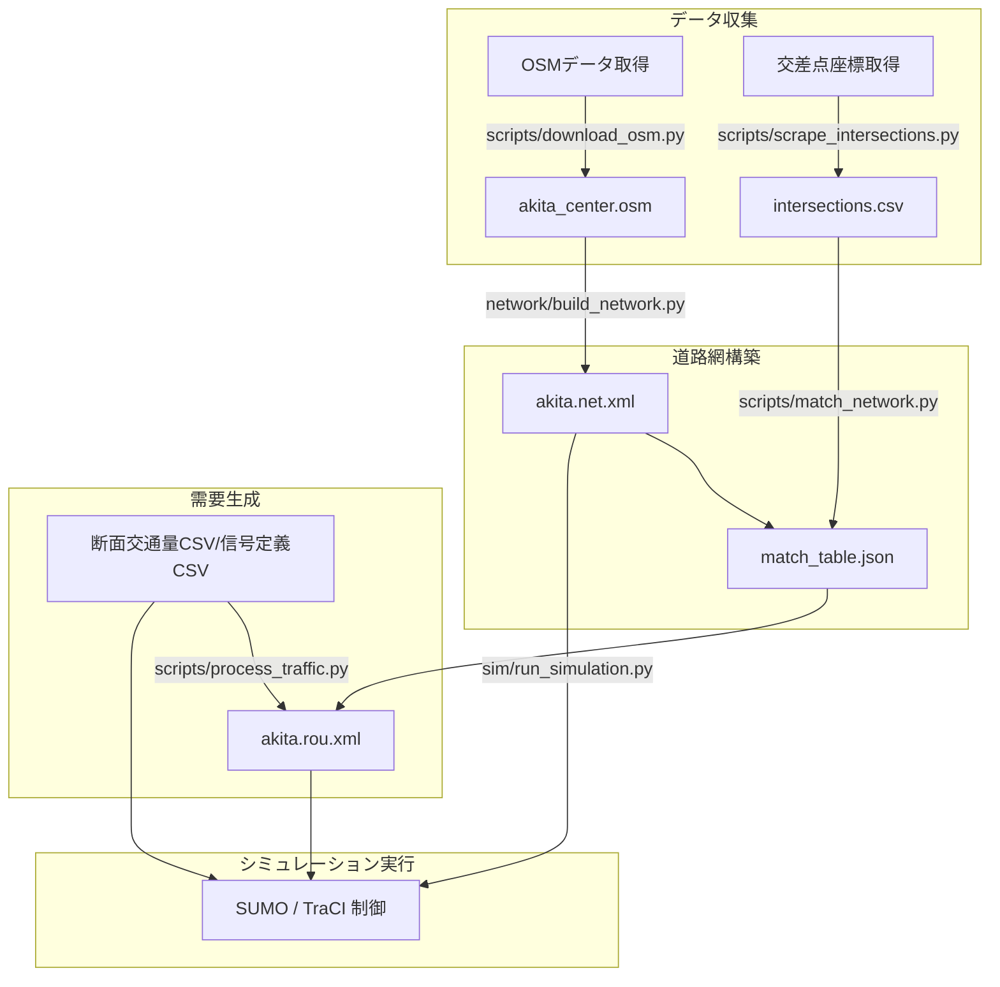

# プロジェクト全体概要

本プロジェクトは、秋田県秋田市中心部（山王十字路周辺等）の道路ネットワークにおいて、実世界の断面交通量および信号制御オープンデータを連動させた高度な交通シミュレーション環境を提供するシステムです。

## 主な目的

1. **現実世界の再現**: OpenStreetMap (OSM) から自動生成された高精度な道路ネットワークの上に、秋田県警から公開された実世界の断面交通量と信号機パラメータ（スプリット・サイクル時間）を適用し、山王十字路などの主要交差点の交通状態を忠実に再現します。
2. **交通流分析と対策検討**: 曜日や時間帯に応じた交通量・信号フェーズの変化が、渋滞発生や平均旅行時間に与える影響を分析します。
3. **拡張性と自動化**: Python SDK (TraCI) を活用して、外部の制御アルゴリズム（AIによる信号制御など）を動的に適用可能な構成にします。

## 技術スタック

* **シミュレーションエンジン**: [SUMO (Simulation of Urban MObility)](https://sumo.dlr.de/) 1.27.0+
* **開発言語**: Python 3.12+
* **制御インターフェイス**: TraCI (Traffic Control Interface)
* **地図データ**: OpenStreetMap (OSM)

## アーキテクチャとデータフロー

シミュレーション環境は、データ収集・道路網構築・需要生成・実行制御の4つのフェーズで構成されています。

### 1. データ収集
- `download_osm.py` を用いて、対象エリア（秋田市中心部）の OSM データをダウンロードします。
- `scrape_intersections.py` で主要な交差点座標を抽出し、CSVに保存します。

### 2. 道路網構築
- `build_network.py` で、ダウンロードした OSM データを SUMO 形式の道路網ファイル（`.net.xml`）に変換します。その際、レーン接続等の修正パッチをあてます。
- `match_network.py` は、道路網上の交差点（ノード）と秋田県警オープンデータの交差点IDを自動紐付けし、`match_table.json` を生成します。

### 3. 需要生成
- `process_traffic.py` は、指定された日時・時間帯の断面交通量（CSVデータ）を解析し、各交差点を通過する車の流れ（ルートとフロー）を計算して、`akita.rou.xml` に出力します。

### 4. シミュレーション実行
- `run_simulation.py` を起動すると、`akita.sumocfg` の設定に基づいてシミュレーションが始まります。実行時、Python 側で TraCI API を経由し、その日時の信号スプリット・サイクル情報を動的に信号機ノードへ適用します。
